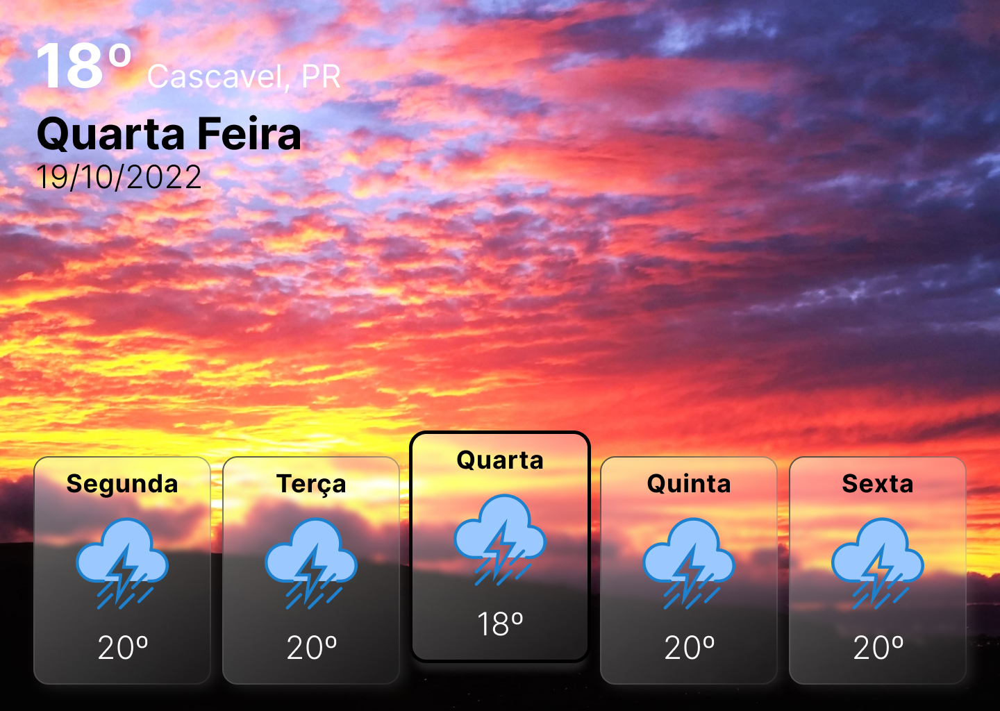
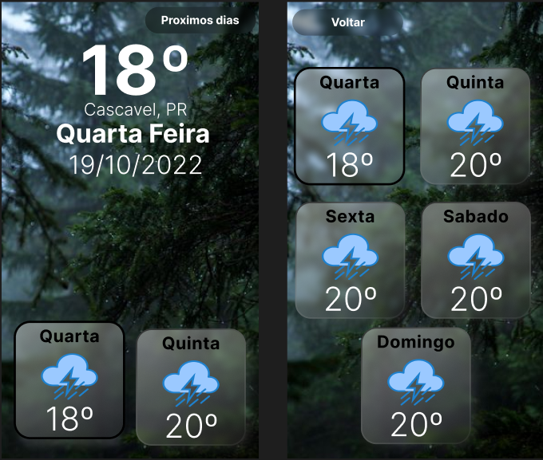

# DailyWeather!
Projeto terá como ideia principal mostrar as condições climaticas da sua região ou local escolhido utilizando a API da 
**[WeatherAPI](https://www.weatherapi.com/docs/)**.

## 🎯 Objetivo do projeto
O projeto será desenvolvido com material de estudo e para aplicação do conhecimento em testes e criação de componentes reutilizaveis em react, além de consolidar boas praticas de programação.
## 🎨Design do projeto
**[Figma do projeto](https://www.figma.com/file/aF2NoQamOK08pbz3mWEl2H/WeatherApp?node-id=5%3A88)**

### ✅ Checklist do projeto

 - [x] Design do projeto.
 - [x] Configurar ambiente de desenvolvimento.
 - [x] Subir projeto na vercel.
 - [] Conexão da API com o projeto.
 - [] Criar versão desktop.
 - [] Criar versão mobile.
 - [] Criar testes para o projeto.
 
## ✏️ Resultado final

[Projeto na vercel](https://daily-weather.vercel.app/)

## Licença
 **[MIT](https://mit-license.org/)**
